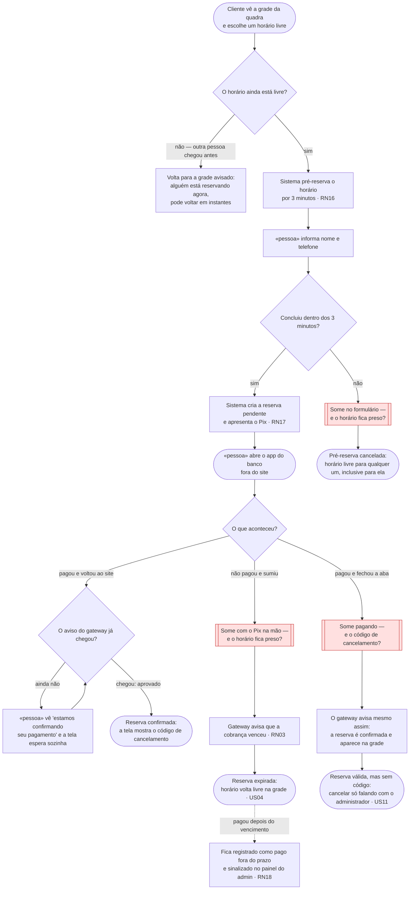

# 🗺️ Jornadas de Usuário

**Projeto:** Reserva de Horários em Quadras de Areia
**Versão:** 1.0.0
**Última atualização:** 2026-09-20

> 🤖 **Este documento é a fonte da verdade sobre O QUE A PESSOA VIVE na tela** —
> o caminho do primeiro clique até o objetivo, e principalmente os pontos onde ela
> trava, espera ou desiste.
>
> ✍️ **Não preencha na mão:** rode `/utf-flows`. A entrevista escolhe a história que
> merece o desenho, obriga o ponto de desistência a aparecer e cobra a decisão sobre
> ele.
>
> 🚫 **Não duplique:** regra de negócio mora no `prd.md`; estado, entidade e contrato
> moram no `architecture.md`. Aqui mora o caminho.

---

## Jornada 1 — Reservar um horário e pagar o Pix

**Story:** US02 e US03 (o vencimento da cobrança é a US04)
**Critérios que ela marca:** sai do site e volta · depende do tempo · depende de outra pessoa · pode ser abandonada

Esta é a única jornada do projeto que marca os quatro critérios, e por um motivo só:
ela é a história inteira do produto. É aqui que o horário sai de "livre para qualquer
um" e vira "de alguém", e cada passo dessa passagem depende de algo que não está sob
o controle da tela — o relógio, o app do banco, o aviso do gateway.

**O que decidimos sobre o nó vermelho X1 — some no formulário, dentro dos 3 minutos:**

Nada fica preso. Os 3 minutos da pré-reserva são contados pelo sistema e não têm
renovação nem aviso prévio: passou o prazo, a pré-reserva é cancelada e o horário
volta a ficar livre para qualquer pessoa — inclusive para quem acabou de perder o
prazo, que pode tentar de novo. Enquanto a pré-reserva está de pé, o horário aparece
na grade como *em reserva* e ninguém mais consegue abrir aquela tela, que é o que
impede duas pessoas de preencherem o mesmo horário ao mesmo tempo. Foi escolhido
segurar o horário em vez de deixar todo mundo entrar porque o problema que esta
plataforma existe para resolver é exatamente o horário prometido a duas pessoas.

**O que decidimos sobre o nó vermelho X2 — some com o Pix na mão, sem pagar:**

Também não fica preso, mas por outro dono: aqui quem conta o prazo é o gateway, não o
sistema. A reserva pendente segura o horário enquanto a cobrança Pix estiver válida, e
cai quando o gateway avisa que ela venceu — o sistema não fica olhando o relógio por
conta própria. Os dois prazos são sequenciais e não se somam: os 3 minutos acabam no
instante em que o Pix é gerado, e dali em diante o relógio é o do gateway. Se o
pagamento chegar depois de a reserva já ter expirado, ele **não** reconfirma nada
sozinho: fica registrado como pago fora do prazo e sinalizado no painel, porque nesse
intervalo o horário pode já ter sido vendido para outra pessoa — e essa conversa é
humana, não automática.

**O que decidimos sobre o nó vermelho X3 — paga e fecha a aba antes de ver o código:**

A reserva vale. O pagamento foi feito, o gateway avisa, a reserva é confirmada e o
horário aparece ocupado na grade com o primeiro nome da pessoa — fechar a aba não
desfaz um Pix pago. O que se perde é o código de cancelamento, que só é mostrado na
tela de confirmação e não é enviado por nenhum outro canal, porque WhatsApp, e-mail e
SMS estão fora de escopo. Quem perder o código e precisar cancelar fala com o
administrador, que cancela a reserva pelo painel — é para isso que a US11 existe. Foi
decidido não criar uma tela pública de "recuperar meu código": ela seria uma segunda
porta que aceita segredo sem login, e como o telefone do cliente é adivinhável, essa
porta enfraqueceria justamente o que torna o código seguro. Uma porta dessas, e só
uma, é o limite que o projeto aceita. Do lado humano, o administrador confere o
**número de origem do contato** contra o telefone gravado na reserva, que ele vê no
painel — não é o mesmo que o telefone digitado num campo: para passar nessa
conferência é preciso ligar daquele número, e não apenas sabê-lo. Ainda assim é
conferência humana, falível e **não garantida pelo sistema**: identificador de
chamada se falsifica, e quem procurar o administrador por mensagem em vez de ligação
não deixa número nenhum para conferir. Dentro do sistema nada muda — a única porta
pública do cliente continua aceitando só o código.

**Sobre a espera (o nó amarelo do meio):** quem paga e volta ao site antes do aviso
chegar não vê a grade nem uma tela morta — vê *"estamos confirmando seu pagamento"*, e
essa tela espera por conta própria até virar a confirmação com o código. Não é
enfeite: como não existe notificação, esse é o único momento em que o código de
cancelamento pode ser entregue a quem fez tudo certo. A reserva continua pendente até
o aviso chegar — voltar do banco não confirma nada, só o gateway confirma.

---

## Dúvidas em aberto

| # | Dúvida | Onde ela precisa ser resolvida |
| --- | --- | --- |
| 1 | Que validade dar à cobrança Pix ao criá-la? A escolha define quanto tempo o horário fica preso no nó X2. | `/utf-architecture` — já registrada como Dúvida 1 do `prd.md` |
| 2 | Quanto tempo a tela de espera fica esperando antes de dizer alguma coisa à pessoa? | `/utf-architecture` |

---

## 🛠️ Histórico

| Data | Versão | O que mudou |
| :--- | :----- | :---------- |
| 2026-09-20 | 1.0.0 | Jornada de pagamento (US02+US03) via `/utf-flows` |
